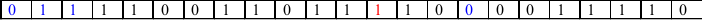

**Autor: Aarón Socas Gaspar**

# CIFRADO A5

##Objetivo

Implementar el cifrado A5 utilizado en telefonía móvil


##Desarrollo

Implementa el cifrado A5 según el esquema siguiente:


Recuerda que los polinomios utilizados son:

```
    LFSR1: p1 (x) = x^19 + x^18 + x^17 + x^14 + 1, genera a(t)
    LFSR2: p2 (x) = x^22 + x^21 + 1, genera b(t)
    LFSR2: p3 (x) = x^23 + x^22 + x^21 + x^8 + 1, genera c(t)
```
Además las posiciones que determinan la entrada a la función mayoría son: del LFSR1, la posición 9, del LFSR2, la posición 11 y por
último, del LFSR3 la posición 11.

Dicha función mayoría viene definida por la expresión F (a9,b11,C11) = a9 * b11 ⊕ a9 * C11 ⊕ b11C11.

De esta forma, si el bit de la celda del registro coincide con el resultado de F, dicho registro estará en movimiento y se desplazará, en caso
contrario no desplazará.

Un ejemplo de cómo se utiliza la función mayoría es el siguiente:
Supongamos (a9 ,b11 ,c11 ) = (0,0,1) en la etapa i, entonces F(a9 ,b11 ,c11 ) = 0 con lo que los registros de desplazamiento 1 y 2 generarán en la
siguiente etapa un nuevo bit cada uno y actualizarán sus estados, mientras que el LFSR3 mantendrá sin cambios su estado, generando en
la etapa siguiente el mismo bit de salida.

Finalmente, la secuencia de salida del A5 se obtiene de la siguiente manera: z(t) = a(t) ⊕ b(t) ⊕ c(t)
A continuación se muestra una traza:

Semilla:
```
	1001000100011010001
     0101100111100010011010
    10111100110111100001111
```


F(0,0,1) = 0 Registro tres queda paralizado
z(t) = a(t) ⊕ b(t) ⊕ c(t) = 0


F(1,0,1) = 1 Registro dos queda paralizado
z(t) = a(t) ⊕ b(t) ⊕ c(t) = 0



F(1,0,1) = 1 Registro dos queda paralizado
z(t) = a(t) ⊕ b(t) ⊕ c(t) = 1


F(0,0,1) = 0 Registro tres queda paralizado
z(t) = a(t) ⊕ b(t) ⊕ c(t) = 1


F(1,0,1) = 1 Registro dos queda paralizado
z(t) = a(t) ⊕ b(t) ⊕ c(t) = 1


F(0,0,0) = 0 Ningún registro queda paralizado
z(t) = a(t) ⊕ b(t) ⊕ c(t) = 1


##Ejecución

Antes de nada debemos compilar:
`
    g++ main.cpp a5.cpp -o a5 (o salida que deseen)
`

Para ejecutar en Linux:
`
    ./a5 (o nombre de salida escogido)
    
    Introduzca ./a5 nombre_fichero
    Se adjuntan dos ficheros para pruebas: semillas1 y semillas2
`

--------------------------------------------------------------------------
*Aarón Socas Gaspar- Seguridad de Sistemas Informáticos (Curso 2013-2014)*